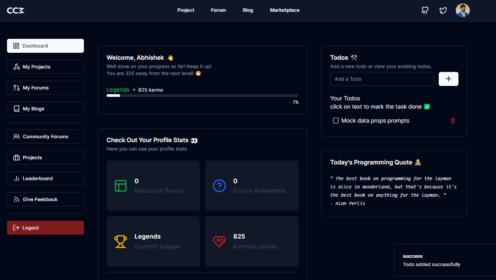

> # WELCOME TO CODE COMMUNITY MUSIC CLIENT REPOSITORY.
### **Who are we?**
**ANS:** Code Community Music is a community driven platform for developers to share and collaborate on projects and ideas. We are a group of developers who are passionate about solving problems and building solutions.
It started as a small summer vacation project and has now grown into a full fledged community.

#### [Explore us](https://codecommunitymusic.vercel.app/)



## Feel absolutely welcome to make a valuable contribution.
### **Local Environment Setup:**
**1. Clone our Repository:**

```
git clone https://github.com/Abbhiishek/codecommunitymusic-client.git 
```

**2. Install necessary Packages:**

```
yarn install 
```
or
```
npm install
```
> **Recommendation**: We kindly request you to use the **yarn** package manager.[Learn yarn](https://yarnpkg.com/)

**3.Connect with Backend:**

Add Backend urls into ``` .env ```
```
APP_URL=http://localhost:3000/
NEXT_PUBLIC_BACKEND_URL=http://127.0.0.1:8000/
BACKEND_URL=http://127.0.0.1:8000/
```
> **Warning:** Ports :8000/3000 depend on local server. So carefully follow your own terminal and paste the exact port number. [Learn More.](https://github.com/Abbhiishek/codecommunitymusic-server/)

**4. Host on your Local Machine:**
```
yarn run dev
or 
npm run dev
```
---
###   I hope these instructions help you set up your local environment. If you are facing any issues regarding the setup, please feel free to share them with us.

> We also have backend setup instructions. Please go to the backend repository to learn more.
[CodeCommunityMusic-Server.](https://github.com/Abbhiishek/codecommunitymusic-server/)